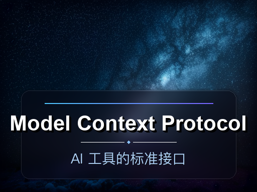
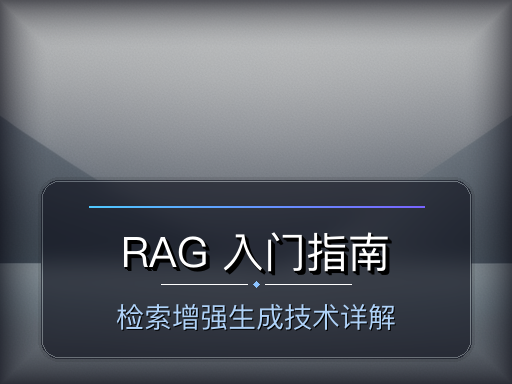
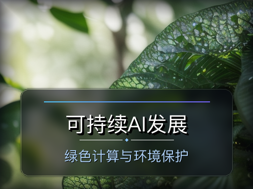
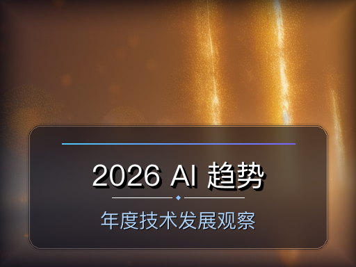
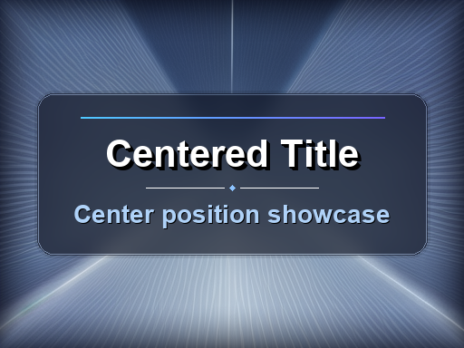
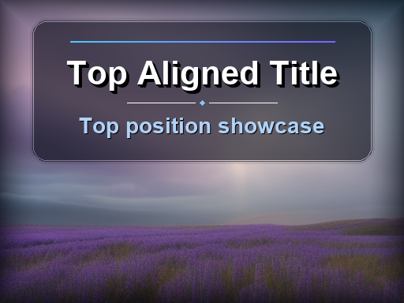

# tiny-sd-cover-generator

Universal Tiny SD + Pillow cover image generator skill.

This repository is not tied to Hugo. You can use it for:
- blog covers
- social media thumbnails
- documentation headers
- video cover images
- slide title cards

## Structure

```text
tiny-sd-cover-generator/
	SKILL.md
	scripts/
		generate_image.py
		batch_generate.py
		jobs.example.json
		requirements.txt
```

## Install

```bash
pip install -r scripts/requirements.txt
```

## Gallery

### 6 Built-in Styles

All examples below use `--steps 28` with text overlay at `bottom` position.

<table>
<tr>
<td width="50%">

**Tech Style**

Deep blue and purple particles, suitable for AI/programming topics.


**Prompt:**
```
masterpiece, best quality, abstract technology background, 
glowing digital particles and flowing light streaks, 
deep blue and purple color palette, volumetric light, 
depth of field, futuristic, clean composition, no text, 4k
```

**Title:** AI Agent Engineering  
**Subtitle:** 从 ReAct 到多智能体协作  
**Seed:** 101

</td>
<td width="50%">

**Cosmic Style**

Deep space nebula, suitable for large-scale AI trends.



**Prompt:**
```
masterpiece, best quality, cosmic nebula background, 
swirling galaxy dust and distant stars, 
deep navy blue and soft teal color palette, 
cinematic lighting, god rays, ethereal atmosphere, no text, 4k
```

**Title:** Model Context Protocol  
**Subtitle:** AI 工具的标准接口  
**Seed:** 202

</td>
</tr>
<tr>
<td width="50%">

**Minimal Style**

Clean geometric gradients, suitable for tutorials and guides.



**Prompt:**
```
masterpiece, best quality, minimalist geometric abstract background, 
smooth gradient shapes and clean lines, 
muted blue and slate gray color palette, soft ambient light, 
clean modern design, no text, 4k
```

**Title:** RAG 入门指南  
**Subtitle:** 检索增强生成技术详解  
**Seed:** 303

</td>
<td width="50%">

**Cyberpunk Style**

Neon grids and dark atmosphere, suitable for engineering practices.


**Prompt:**
```
masterpiece, best quality, cyberpunk abstract background, 
neon grid lines and glowing circuit patterns, 
electric purple and hot pink color palette, 
dramatic rim light, dark atmosphere, high contrast, no text, 4k
```

**Title:** Neural Networks  
**Subtitle:** Deep Learning Architecture  
**Seed:** 404

</td>
</tr>
<tr>
<td width="50%">

**Nature Style**

Soft organic curves, suitable for sustainability topics.



**Prompt:**
```
masterpiece, best quality, organic abstract background, 
flowing translucent leaves and botanical curves, 
soft emerald green and warm ivory color palette, 
diffused natural light, shallow depth of field, serene, no text, 4k
```

**Title:** 可持续AI发展  
**Subtitle:** 绿色计算与环境保护  
**Seed:** 505

</td>
<td width="50%">

**Warm Style**

Golden rays and energetic vibes, suitable for trends and insights.



**Prompt:**
```
masterpiece, best quality, warm abstract background, 
golden light rays and soft bokeh spheres, 
amber orange and deep gold color palette, 
glowing backlight, haze effect, energetic, uplifting, no text, 4k
```

**Title:** 2026 AI 趋势  
**Subtitle:** 年度技术发展观察  
**Seed:** 606

</td>
</tr>
</table>

### Background Only (No Text Overlay)

Pure background without text overlay - perfect for wallpapers or when text will be added later in other tools.


**Prompt:**
```
masterpiece, best quality, abstract flowing light ribbons, 
glowing particles in motion, blue cyan and purple gradient, 
cinematic depth, volumetric light, no text, 4k
```

**Seed:** 707 | **Steps:** 28

### Text Position Options

Text overlay supports three positions: `bottom` (default), `center`, and `top`.

<table>
<tr>
<td width="50%">

**Center Position**



**Position:** `center`  
**Seed:** 808

</td>
<td width="50%">

**Top Position**



**Position:** `top`  
**Seed:** 909

</td>
</tr>
</table>

---

## Single Image

```bash
python3 scripts/generate_image.py \
	--title "AI Agent Engineering" \
	--subtitle "From ReAct to Multi-Agent" \
	--prompt "abstract glowing AI network, blue and cyan particles" \
	--output "outputs/agent-cover.png" \
	--steps 28 \
	--seed 42
```

`--title` and `--subtitle` are optional.

- With `--title`: generates image + text overlay.
- Without `--title`: generates background image only.

Background-only example:

```bash
python3 scripts/generate_image.py \
	--prompt "abstract flowing light ribbons, blue and cyan particles" \
	--output "outputs/background-only.png"
```

## Batch Mode

Edit `scripts/jobs.example.json`, then run:

```bash
python3 scripts/batch_generate.py --jobs scripts/jobs.example.json
```

## Notes

- Prompts should be in English for Stable Diffusion models.
- `generate_image.py` auto-adds quality prefix and `no text, 4k` suffix for custom prompts.
- The script draws text via Pillow, not the diffusion model, to ensure readable titles.
