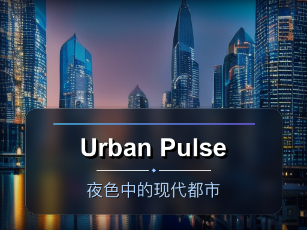
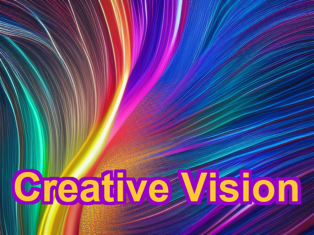

# tiny-sd-cover-generator

Universal Tiny SD + Pillow cover image generator skill.

This repository is not tied to Hugo. You can use it for:
- blog covers
- social media thumbnails
- documentation headers
- video cover images
- slide title cards

## Structure

```text
tiny-sd-cover-generator/
	SKILL.md
	scripts/
		generate_image.py
		batch_generate.py
		jobs.example.json
		requirements.txt
```

## Install

```bash
pip install -r scripts/requirements.txt
```

## Gallery

### Scene Types

**Animal Photography**


```bash
python3 scripts/generate_image.py \
  --prompt "a fluffy orange tabby cat sitting on a wooden windowsill, soft natural light, bokeh background, photorealistic, 4k" \
  --title "Feline Grace" \
  --subtitle "Portrait of a curious cat" \
  --output outputs/cat.png \
  --seed 101
```

---

**Landscape Photography**


```bash
python3 scripts/generate_image.py \
  --prompt "snow-capped mountain peaks at sunrise, dramatic clouds, alpine lake reflection, vibrant orange and pink sky, landscape photography, 4k" \
  --title "Alpine Heights" \
  --subtitle "Journey to the Summit" \
  --output outputs/mountain.png \
  --seed 202
```

---

**Urban & Architecture**



```bash
python3 scripts/generate_image.py \
  --prompt "modern city skyline at blue hour, skyscrapers with illuminated windows, reflections on river, cinematic composition, architectural photography, 4k" \
  --title "Urban Pulse" \
  --subtitle "夜色中的现代都市" \
  --output outputs/city.png \
  --seed 303
```

---

**Science Fiction**


```bash
python3 scripts/generate_image.py \
  --prompt "astronaut floating in space with earth in background, stunning nebula and stars, cosmic vista, cinematic lighting, science fiction, 4k" \
  --title "Beyond Earth" \
  --subtitle "Exploring the Cosmos" \
  --position center \
  --output outputs/space.png \
  --seed 404
```

---

### Text Style Customization

**Custom Colors & Outline**



```bash
python3 scripts/generate_image.py \
  --prompt "abstract flowing ribbons of light, vibrant colors, digital art, 4k" \
  --title "Creative Vision" \
  --title-size 65 \
  --title-color "255,200,50,255" \
  --outline-width 5 \
  --outline-color "150,0,200,220" \
  --output outputs/custom.png \
  --seed 505
```

**Configuration:**
- Title size: `65` (larger than default)
- Title color: `255,200,50,255` (golden yellow)
- Outline width: `5` (thicker border)
- Outline color: `150,0,200,220` (purple with transparency)

---

## Usage Examples

### Basic Usage

Background image only:

```bash
python3 scripts/generate_image.py \
  --prompt "tropical beach with turquoise water, white sand, paradise island, 4k" \
  --output outputs/beach.png
```

With text overlay (default style):

```bash
python3 scripts/generate_image.py \
  --prompt "majestic lion in african savanna, golden hour, wildlife photography, 4k" \
  --title "Wildlife Photography" \
  --subtitle "Exploring Nature's Beauty" \
  --output outputs/lion.png
```

### Text Customization

Custom font size:

```bash
python3 scripts/generate_image.py \
  --prompt "minimalist geometric background, soft gradient, 4k" \
  --title "Large Title" \
  --title-size 70 \
  --subtitle-size 30 \
  --output outputs/large-text.png
```

Custom colors:

```bash
python3 scripts/generate_image.py \
  --prompt "sunset ocean waves, warm colors, 4k" \
  --title "Ocean Sunset" \
  --title-color "255,100,50,255" \
  --subtitle-color "255,200,150,255" \
  --output outputs/warm-colors.png
```

No outline (clean look):

```bash
python3 scripts/generate_image.py \
  --prompt "clean white background, minimal, 4k" \
  --title "Clean Design" \
  --outline-width 0 \
  --output outputs/no-outline.png
```

Text position options:

```bash
# Bottom (default)
python3 scripts/generate_image.py \
  --prompt "landscape scene, 4k" \
  --title "Bottom Text" \
  --position bottom \
  --output outputs/bottom.png

# Center
python3 scripts/generate_image.py \
  --prompt "symmetric composition, 4k" \
  --title "Centered" \
  --position center \
  --output outputs/center.png

# Top
python3 scripts/generate_image.py \
  --prompt "sky scene, 4k" \
  --title "Top Text" \
  --position top \
  --output outputs/top.png
```

### Generation Parameters

Control image quality:

```bash
python3 scripts/generate_image.py \
  --prompt "detailed portrait, 4k" \
  --steps 30 \
  --seed 42 \
  --output outputs/quality.png
```

- `--steps`: Inference steps (20-35 recommended, higher = better quality but slower)
- `--seed`: Random seed for reproducibility (same seed = same output)

---

## Batch Mode

Create a JSON file with multiple jobs:

```json
{
  "jobs": [
    {
      "name": "cat-portrait",
      "prompt": "cute cat on windowsill, soft light, 4k",
      "title": "Feline Grace",
      "output": "outputs/cat.png",
      "seed": 101,
      "steps": 28
    },
    {
      "name": "mountain-landscape",
      "prompt": "mountain peaks at sunrise, 4k",
      "title": "Alpine Heights",
      "subtitle": "Journey to the Summit",
      "output": "outputs/mountain.png",
      "seed": 202,
      "steps": 28,
      "position": "bottom"
    }
  ]
}
```

Run batch generation:

```bash
python3 scripts/batch_generate.py --jobs your_jobs.json
```

---

## Notes

- **Prompts must be in English** - Stable Diffusion models only understand English
- **Prompt parameter is required** - No built-in style templates
- **Text overlay is optional** - Omit `--title` to generate background only
- **Default image size**: 512×384 (4:3 ratio)
- **Color format**: `R,G,B,A` or `R,G,B` (e.g., `255,0,0,200` for semi-transparent red)
