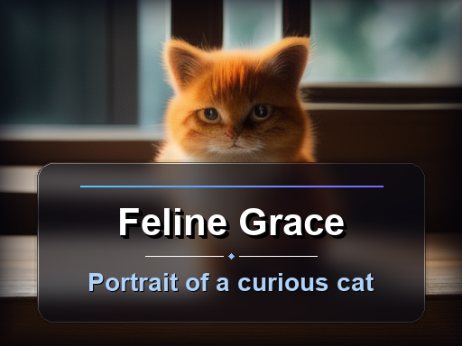
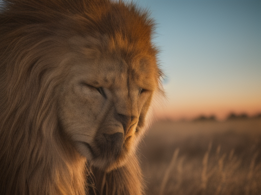
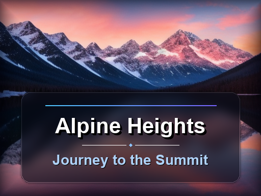
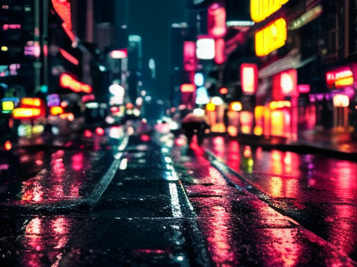
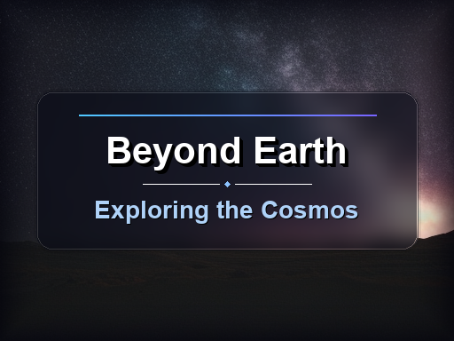
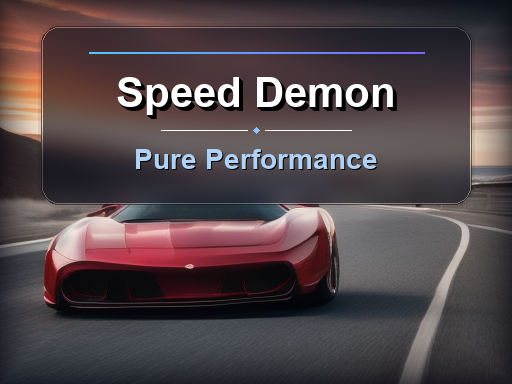

# tiny-sd-cover-generator

Universal Tiny SD + Pillow cover image generator skill.

This repository is not tied to Hugo. You can use it for:
- blog covers
- social media thumbnails
- documentation headers
- video cover images
- slide title cards

## Structure

```text
tiny-sd-cover-generator/
	SKILL.md
	scripts/
		generate_image.py
		batch_generate.py
		jobs.example.json
		requirements.txt
```

## Install

```bash
pip install -r scripts/requirements.txt
```

## Gallery

Showcase of various scene types. All examples use `--steps 28`.

### Animals

<table>
<tr>
<td width="50%">

**Cat** (with text overlay)



**Prompt:**
```
a fluffy orange tabby cat sitting on a wooden windowsill,
soft natural light, bokeh background, photorealistic, 4k
```

**Title:** Feline Grace  
**Subtitle:** Portrait of a curious cat  
**Seed:** 101  
**Position:** bottom

</td>
<td width="50%">

**Lion** (background only)



**Prompt:**
```
majestic male lion with flowing mane, african savanna at golden hour,
warm sunset light, shallow depth of field, wildlife photography, 4k
```

**Seed:** 202

</td>
</tr>
</table>

### Landscape

<table>
<tr>
<td width="50%">

**Mountain** (with text overlay)



**Prompt:**
```
snow-capped mountain peaks at sunrise, dramatic clouds,
alpine lake reflection, vibrant orange and pink sky,
landscape photography, 4k
```

**Title:** Alpine Heights  
**Subtitle:** Journey to the Summit  
**Seed:** 303  
**Position:** bottom

</td>
<td width="50%">

**Ocean** (background only)


**Prompt:**
```
tropical beach with turquoise water, white sand,
palm trees swaying, blue sky with fluffy clouds,
paradise island, 4k
```

**Seed:** 404

</td>
</tr>
</table>

### City & Urban

<table>
<tr>
<td width="50%">

**Skyline** (with text overlay)


**Prompt:**
```
modern city skyline at blue hour, skyscrapers with illuminated windows,
reflections on river, cinematic composition,
architectural photography, 4k
```

**Title:** Urban Pulse  
**Subtitle:** 夜色中的现代都市  
**Seed:** 505  
**Position:** bottom

</td>
<td width="50%">

**Street** (background only)



**Prompt:**
```
rainy city street at night, neon signs reflecting on wet pavement,
bokeh lights, cyberpunk aesthetic, moody atmosphere, 4k
```

**Seed:** 606

</td>
</tr>
</table>

### Science Fiction

<table>
<tr>
<td width="50%">

**Space** (with text overlay)



**Prompt:**
```
astronaut floating in space with earth in background,
stunning nebula and stars, cosmic vista,
cinematic lighting, science fiction, 4k
```

**Title:** Beyond Earth  
**Subtitle:** Exploring the Cosmos  
**Seed:** 707  
**Position:** center

</td>
<td width="50%">

**Robot** (background only)


**Prompt:**
```
futuristic humanoid robot with glowing blue eyes,
sleek metallic surface, high-tech laboratory background,
dramatic lighting, sci-fi concept art, 4k
```

**Seed:** 808

</td>
</tr>
</table>

### Vehicles & Food

<table>
<tr>
<td width="50%">

**Sports Car** (with text overlay)



**Prompt:**
```
red luxury sports car on coastal highway, motion blur,
golden hour lighting, dramatic sky, automotive photography, 4k
```

**Title:** Speed Demon  
**Subtitle:** Pure Performance  
**Seed:** 909  
**Position:** top

</td>
<td width="50%">

**Coffee** (background only)


**Prompt:**
```
steaming cup of latte art coffee on rustic wooden table,
morning light through window, cozy cafe atmosphere,
food photography, 4k
```

**Seed:** 1010

</td>
</tr>
</table>

---

## Single Image

Basic usage:

```bash
python3 scripts/generate_image.py \
	--prompt "a majestic lion in african savanna, golden hour" \
	--output "outputs/lion.png"
```

With text overlay:

```bash
python3 scripts/generate_image.py \
	--prompt "modern city skyline at night, neon lights" \
	--title "Urban Pulse" \
	--subtitle "Modern Architecture" \
	--output "outputs/city.png" \
	--position bottom
```

`--title` and `--subtitle` are optional. Without `--title`, generates background image only.

## Batch Mode

Create a jobs JSON file (see `scripts/jobs.showcase.json` for examples):

```json
{
  "jobs": [
    {
      "name": "example-1",
      "prompt": "a cute cat on windowsill, soft light, 4k",
      "output": "outputs/cat.png",
      "seed": 101,
      "steps": 28
    },
    {
      "title": "Mountain Peak",
      "subtitle": "Alpine Adventure",
      "prompt": "snow mountain at sunrise, dramatic clouds, 4k",
      "output": "outputs/mountain.png",
      "seed": 202,
      "steps": 28,
      "position": "bottom"
    }
  ]
}
```

Then run:

```bash
python3 scripts/batch_generate.py --jobs your_jobs.json
```

## Notes

- **Prompts must be in English** - Stable Diffusion models only understand English.
- Prompt parameter is **required** - no built-in style templates.
- The script generates background images directly from your prompts.
- Text overlay (title/subtitle) is optional and rendered with Pillow for precision.
- Default image size: 512×384 (4:3 ratio).
